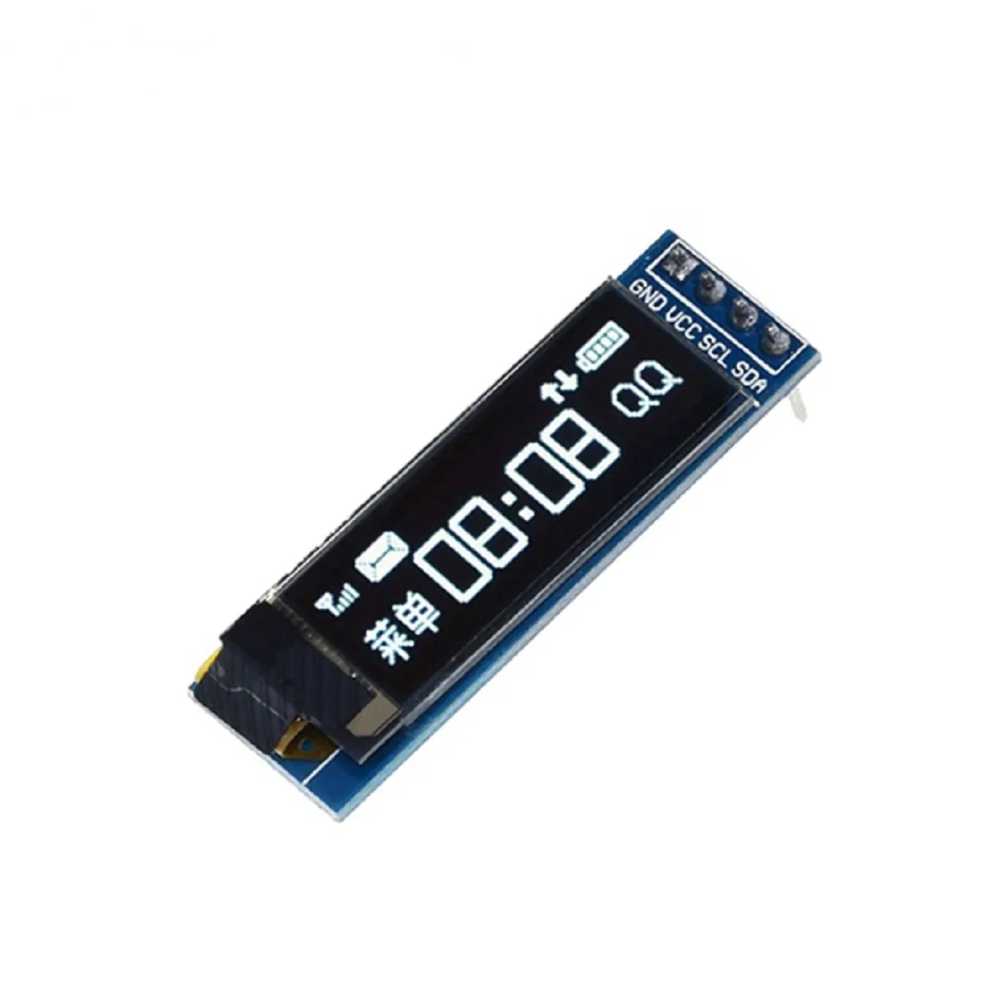
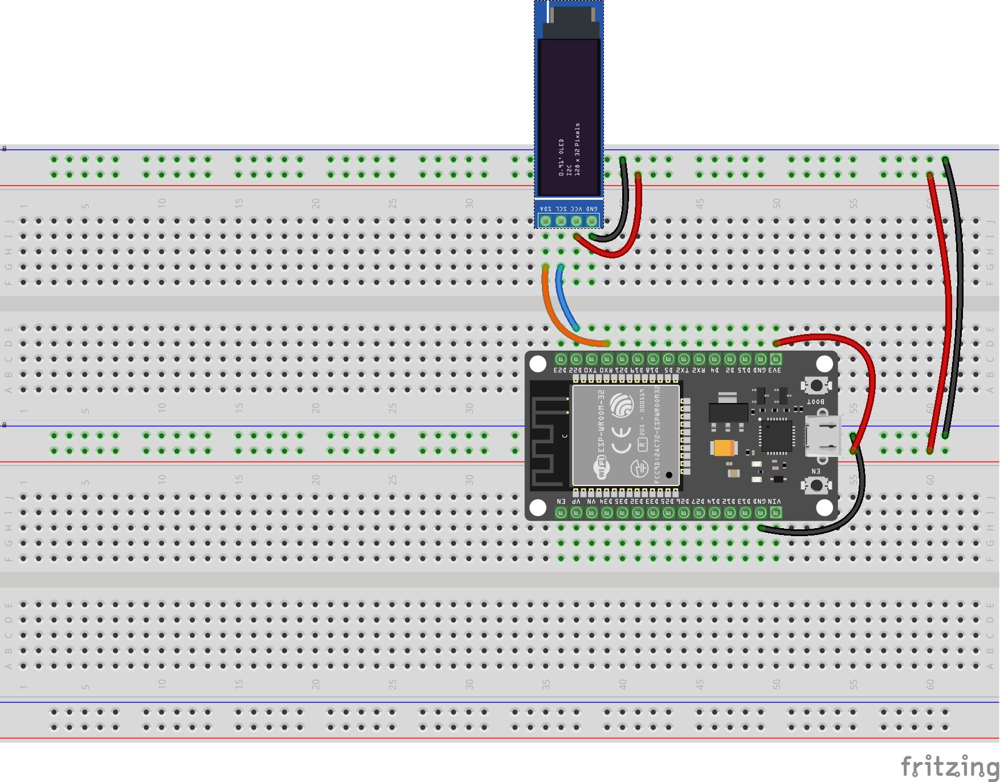

# Demo af OLED display


## Baggrund

TEC har nogle billige "kompatible" OLED displays som er nogenlunde kompatible med AdaFruits tilsvarende. Vi har fået fat i nogen fra producenten [DIYmore](https://www.diymore.cc/collections/esp8266/products/diymore-0-91-inch-iic-i2c-oled-lcd-12832-128x32-display-diy-module-ssd1306-driver-ic-dc-3-3v-5v-stm32-for-arduino-pic).

{style="width: 200px;"}

[AdaFruits produkt](https://www.adafruit.com/product/3527) og endnu en [udgave af SSD1306](https://www.adafruit.com/product/931?srsltid=AfmBOopNlWpeU-medEm65WhmlH9KXTj31XmXUW8f5xtKAyO0ymAkrQ33)

De kan altså bruge driverne, som AdaFruit har udviklet til SSD1306, til denne hardware også.

[AdaFruits driver til SSD1306 findes her](https://github.com/adafruit/Adafruit_SSD1306)

Man kan kigge lidt til Random Nerd Tutorials [ESP32 OLED Display with Arduino IDE](https://randomnerdtutorials.com/esp32-ssd1306-oled-display-arduino-ide/), som har en vejledning til ESP32, dog med Arduino framework og et 128x64 pixels display.\
Mens forbindelserne er næsten de samme. har jeg dog haft hæld med nogle andre pins. Desuden er vores displays 128x32 pixels.

<!-- {width="400"} -->

## C# driver og eksempel

For at bruge OLED displayet sammen med nanoFramework og C#, kan vi bruge device-driveren dss13xx, og dette kode eksemplet. For at bekræfte at det virker, har jeg implementeret og afprøvet med ... som er i mit egent git repo på GitHub.

Det der mangler, i de officielle vejledninger er en konkret opstilling, og et billede eller digram af hvor dan det hele forbindes. Man kan let blive i tvivl om hvor mange ben der "bør" være på displayet, og hvor de skal tilsluttes. Det gør at der er mange valg og dermed fejl muligheder.

## Demo projekt

### Opstilling



| ESP32-DEVKIT-V1 | OLED display |                            |
|-----------------|--------------|----------------------------|
| SDA             | D21          | Data                       |
| SCL             | D22          | Clock                      |
| VCC             | 3v3          | Forsyningsspænding (3,3V)  |
| GND             | GND          | Jord, stel, nul, minus etc |

: Tilslutninger

Jeg vælger at følge kodeeksemplet, og sætte *Data* og *Clock* til hhv. *D21* og *D22*. Hvis man kigger på [Michanti's ESP32-DOIT-DEV-KIT-V1](../assets/ESP32-DOIT-DEV-KIT-v1-pinout-mischianti.png), kan man se at port 21 og 22 er markeret lyssebly felter, hvor der står hhv. \[SDA\] og \[SCL\]. Desværre stemmer det ikke godt overens med tabellen i [nanoFrameworks "ESP32 pinout"](https://docs.nanoframework.net/content/esp32/esp32_pin_out.html)?

### Pakker, Assemblies, Nuget

Med Project -\> Manage Nuget Packages kan du sørge for at det nødvendige pakker er til stede. Du kan også se pakkerne og ders oprindelse i filen `packages.config`:

``` xml
<?xml version="1.0" encoding="utf-8"?>
<packages>
  <package id="nanoFramework.CoreLibrary" version="1.17.11" targetFramework="netnano1.0" />
  <package id="nanoFramework.Hardware.Esp32" version="1.6.34" targetFramework="netnano1.0" />
  <package id="nanoFramework.Iot.Device.Ssd13xx" version="1.3.721" targetFramework="netnano1.0" />
  <package id="nanoFramework.Runtime.Events" version="1.11.32" targetFramework="netnano1.0" />
  <package id="nanoFramework.System.Device.Gpio" version="1.1.57" targetFramework="netnano1.0" />
  <package id="nanoFramework.System.Device.I2c" version="1.1.29" targetFramework="netnano1.0" />
  <package id="nanoFramework.System.Math" version="1.5.116" targetFramework="netnano1.0" />
</packages>
```

**Bemærk**: I sourcen herunder, refereres *også* til namespace'et `Iot.Device.Ssd13xx.Samples`, men det er ***ikke*** et assembly eller en NuGet pakke, men derimod defineret i to filer, som ligger med i projektet; `BasicFont.cs` og `DoubleByteFont.cs`.

### Kode

I demoen initialiseres pin 21 og pin 22, og SSD1306 driveren.\
Selve OLED driveren fungerer sådan at man

-   renser displayet (med `ClearScreen()`)
-   tegner eller skriver noget på display'et (egentlig tegner "bare" i en buffer) \
    Her et f.eks. kald til `device.DrawString(2, 2, "nF IOT!", 2)`
-   det man har tegnet eller skrevet, vises på displayet, ved kald til `Display()`.

**Bemærk**: Det er vigtigt at filerne **BasicFont.cs** og **DoubleByteFont.cs** er med, for de definerer namespacet `Iot.Device.Ssd13xx.Samples` og Class `BasicFont` og `DoubleByteFont`. Uden en font kan man ikke skrive tekst og så virker eksemplet ikke.

``` cs
// Licensed to the .NET Foundation under one or more agreements.
// The .NET Foundation licenses this file to you under the MIT license.

using Iot.Device.Ssd13xx;
using Iot.Device.Ssd13xx.Samples;
using nanoFramework.Hardware.Esp32;
using System.Device.I2c;
using System.Diagnostics;
using System.Threading;

Debug.WriteLine("Hello Ssd1306 Sample!");

//////////////////////////////////////////////////////////////////////
// when connecting to an ESP32 device, need to configure the I2C GPIOs
// used for the bus, for example
Configuration.SetPinFunction(21, DeviceFunction.I2C1_DATA);
Configuration.SetPinFunction(22, DeviceFunction.I2C1_CLOCK);
//////////////////////////////////////////////////////////////////////

using Ssd1306 device = new Ssd1306(
    I2cDevice.Create(new I2cConnectionSettings(1, Ssd1306.DefaultI2cAddress)), 
    Ssd13xx.DisplayResolution.OLED128x32);

device.ClearScreen();
device.Font = new BasicFont();
device.DrawString(2, 2, "nF IOT!", 2);//large size 2 font
device.DrawString(2, 32, "nanoFramework", 1, true);//centered text
device.Display();
Thread.Sleep(200);

device.ClearScreen();
device.Font = new BasicFont();
for (int i = 0; i < 50; i++)
{
    int line = 1;
    Debug.WriteLine($"1, line++, $\"i: {i}\", 1");
    device.Write(1, line++, $"i: {i}", 1);
    device.Write(1, line++, "Hest!", 1, true);
    device.Display();
    Thread.Sleep(500);
}

Debug.WriteLine("End of Ssd1306 Sample!");
Thread.Sleep(Timeout.Infinite);
```

Hele demo-koden findes på <https://github.com/s0ren/intro_til-IOT_med-CS/tree/master/OLED_z>\
Eksemplet er stærkt inspireret af: <https://github.com/nanoframework/nanoFramework.IoT.Device/tree/develop/devices/Ssd13xx/samples>\