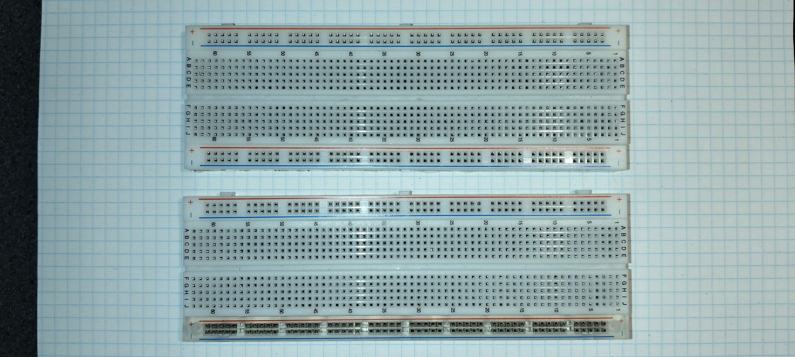
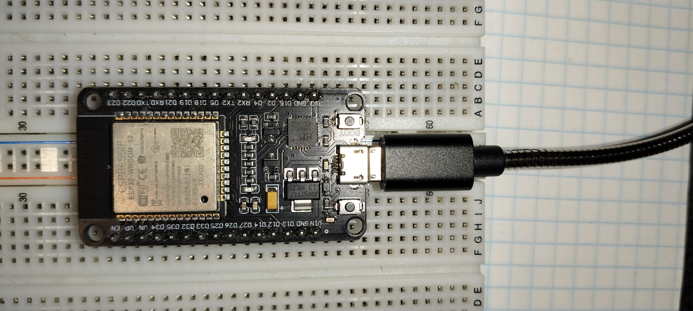
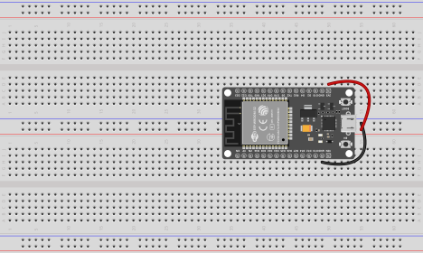
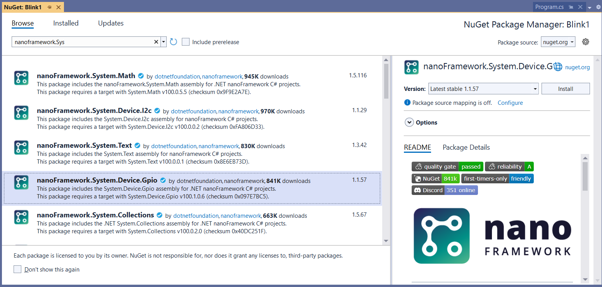
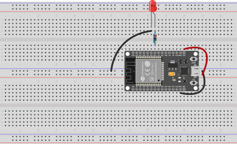
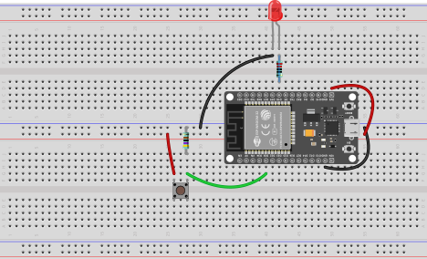

# IoT, første del

På Programmeringsspecialet, er IoT faget opdelt så de første to uger er på H3. De næste to uger afvikles på H4.

Ved slutningen af første de, bedømmes eleverne med en delkarakter. Når anden del afsluttes, bedømmes del 1 og del 2 samlet med en standpunktskarakter.

## Introduktion

### Development Boards

-   Arduino\
    "Det hele startede med Arduino"
-   Esp32\
    Billig og kapabel kinesisk chip

Vi bruger `ESP32-DEVKIT-V1` \[foto\]

### Breadbords

.JPG)

På breadboardet kan vi opbygge en konstruktion med både CPU og Sensorer og Aktustorer

For at få plads til det udviklingsbord vi råder over, skal vi bruge en speciel konstruktion med to (2) breadborads som er sat sammen. På den måde kan vi forbinde til benene begge sider af udviklingsborded.

\[billede\] 



### Sensorer og aktuatorer

Hvad en sensor og en aktuator er...

### Udviklingsmiljø

#### PlatformIO

Vi skal programmere i miljøet PlatformIO. PlatformIO installeres i VisualStudio, som en extension.

**Tip**: opret en "Profil" i VSCode til IOT først.

#### ESP32 og `ESP32-DEVKIT-V1`

Vi benytter udviklingsboardet Do-IT `ESP32-DEVKIT-V1`, med en ESP32 chip på kortet. \
Den er billig, har mere ram, og indbygget wifi mm.

Se mere om ESP hos Espressif, `ESP32-DEVKIT-V1` bordet har et pinot diagram.

Vi bruger arduino-frameworket, fordi der er aller flest eksempler og vejledninger. Alligevel kan man inddrage dele af espressif eget framework.

#### C og C++

Arduino, og espressif og langt de fleste traditionelle projekter med IoT og "embed controllers" programmeres i C/C++. \
Raspberry bruger Python (micro-python), og der findes også et framework til Rust på Arduino og ESP32.

Undervisningen gennemgås med C/C++. Dette minder meget om C#, som vi alle er nogenlunde fortrolige med. \
De væsentligeste

## Øvelser

Souce kode til visse øvelser ligger på <https://github.com/s0ren/intro_til-IOT_med-CS>

### Øvelse 1 - Hello world

Den første øvelse går ud på at oprette et projekt til nanoFramework og afvikle default skabelonen. Et lille program, som skriver en tekst i Debug vinduet.

Du skal montere ESP32 DEVKIT V1 udviklingsboardet på et dobbelt breadboar som vist her:



Når du opretter projektet, skulle der gerne være en `program.cs` med dette:

``` cs
using System;
using System.Diagnostics;
using System.Threading;

namespace hejsa
{
    public class Program
    {
        public static void Main()
        {
            Debug.WriteLine("Hello from nanoFramework!");

            Thread.Sleep(Timeout.Infinite);
        }
    }
}
```

### Øvelse 2 - Hello, blink

Opret et ny **project**, i samme **solution** ved at højreklikke på din *solution* (øverst i **Solution Explorer**), vælg **Add** og **New Project..**, sørg for at templaten er **Blank Application (.NET nanoFramework)**.

Her skal programmet få den indbyggede LED på ESP32'eren til at blinke. Derfor er der ikke brug for at ændre opstillingen på breadboardet. Bare brug den samme opstilling som ovenfor.

Sørg for at denne kode fungerer:

``` cs
using System;
using System.Diagnostics;
using System.Threading;
using System.Device.Gpio;


namespace Blink1
{
    public class Program
    {
        public static void Main()
        {
            Debug.WriteLine("Hello from nanoFramework!");

            int PinNumber = 2;
            GpioPin bultinLED = new GpioController().OpenPin(PinNumber, PinMode.Output);
            
            while (true)
            {
                // Turn on the LED (assuming an active high configuration)
                bultinLED.Write(PinValue.High);
                Thread.Sleep(500); // Keep the LED on for 500 milliseconds
                
                // Turn off the LED
                bultinLED.Write(PinValue.Low);
                Thread.Sleep(500); // Keep the LED off for 500 milliseconds
            }

            Thread.Sleep(Timeout.Infinite);
        }
    }
}
```

**Bemærk** at koden også gør brug af namespacet `System.Device.Gpio`. Dette findes i en pakke fra *nanoFramework* som skal tilføjes til projektet.

1.  Højre-klik på dit projekt
2.  vælg **Manage NuGet Packages...**
3.  
4.  Vælg **Browse**
5.  Søg evt på `nanoFramework.sys`
6.  tryk **Install**

### Øvelse 3 - Hello, blink med en ekstern lysdiode (LED)

Her skal vi bygge på breadboardet.



Det nye er at:

-   der skal være en LED på breadbordet, som skal styres fra boarded.
-   LED'en skal beskyttes mod overspænding med en modstand på 220 ohm.
-   Den positive side af LED'en, det ben der er længst, skal forbindes til pin 18 (via modstanden)
-   LED'ens andet ben skal forbindes til stel. På engelsk Ground eller GND.

Programkoden er næsten den samme, blot er `PinNumber` sat til at være `18` i stedet for `2`:

``` cs
using System;
using System.Device.Gpio;
using System.Diagnostics;
using System.Threading;

namespace Blink2_pin18
{
    public class Program
    {
        public static void Main()
        {
            Debug.WriteLine("Hello from nanoFramework! With police blink blink");

            int PinNumber = 18;
            GpioPin bultinLED = new GpioController().OpenPin(PinNumber, PinMode.Output);
            
            while (true)
            {
                
                // Turn on the LED (assuming an active high configuration)
                bultinLED.Write(PinValue.High);
                Thread.Sleep(500); // Keep the LED on for 500 milliseconds

                // Turn off the LED
                bultinLED.Write(PinValue.Low);
                Thread.Sleep(500); // Keep the LED off for 500 milliseconds
            }
        }
    }
}
```

### Øvelse 3b - Andre timing strategier.

### Øvelse 3d - Ekstra LED

### Øvelse 4 - Input fra trykknap

