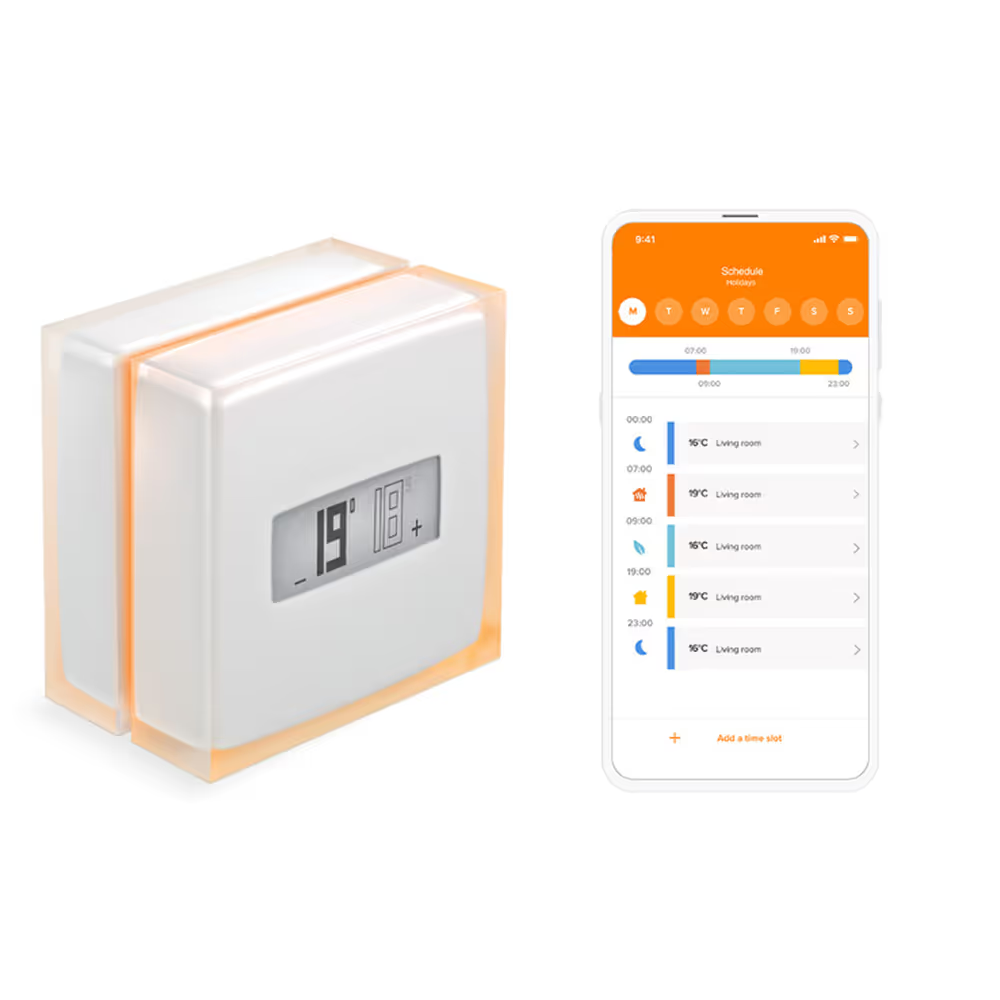
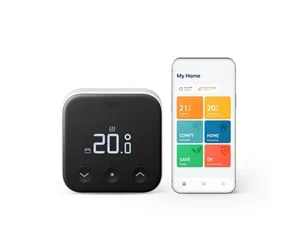
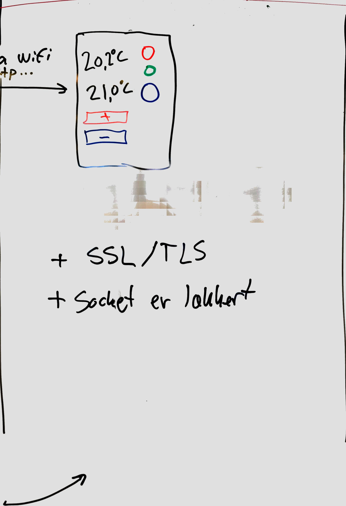
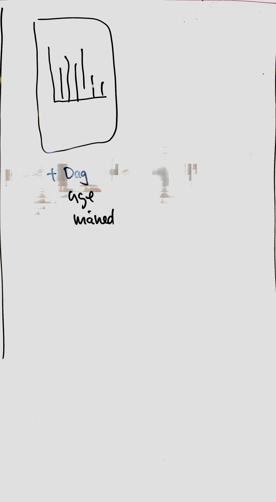
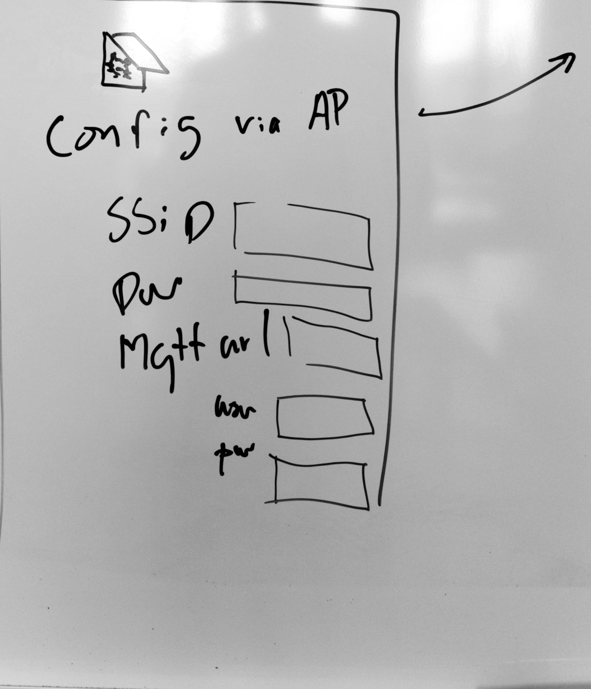
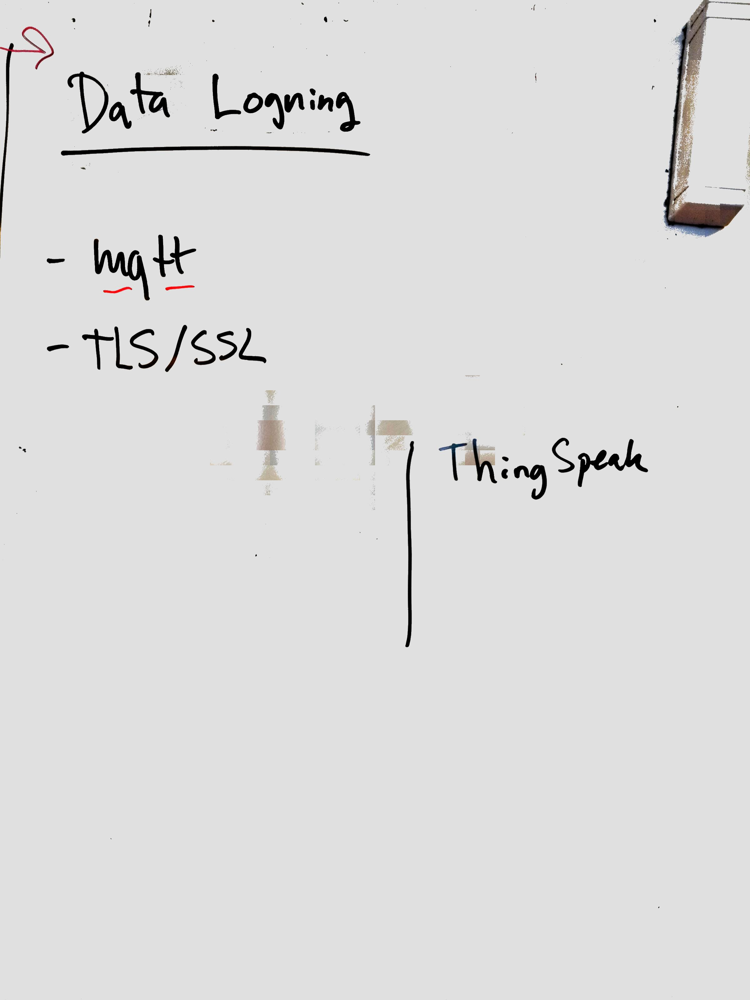

Opgaven er at lave et apparat som fungerer som termostat-konsol [@noauthor_termostat_2024].

-   Den skal kunne betjenes fysisk, og via et webinterface.
-   Man skal kunne konfigurere netværksindstillinger med start, eller efter behov.
-   Apparatet skal kunne overføre målte data og statusoplysninger, via internettet. Fortrinsvis til en mqtt-service.
-   Den skal kunne fungere så optimalt som muligt (og rimeligt) uden direkte strømforsing fra 230V lysnet.

{width="437"}

## Lignende produkter på markedet

Der findes allerede en del pudukter på markedet, både industrielle og til homeautomation. Her er et par eksempler:

|                                      |                                      |
|----------------------------------------|--------------------------------|
| {width="200"} | {width="239"} |
| [@netatmo_smart_2025]                | [@tado_smart_2025]                   |

Du behøver slet ikke implemetere alle features som de kommercielle produkter har.

## Opbygning og virkemåde {#sec-opbygning_og_virkemåde}

### Fysisk opbygning

Apparatet skal have en fast tilsluttet temperatursensor. Her vil jeg anbefale DS18b20. Apparatet skal have et fysisk bruger interface bestående af et OLED display et antal lysdioder. Til at modtage instrukser fra brugeren, skal apparatet nogle knapper. deuden skal apparatet bruge sit indbyggede wifi til web interface og data-afrapportering.

-   en ESP32
-   en temepratursensor (DS18B20)
-   et OLED display (128x32 pixels)
-   tre lysdioder (rød, grøn og blå)
-   tre knapper
-   et sammensat breadbord (med plads til en ESP32)
-   små jumper ledninger, passende antal og farver
-   modstande, 220 ohm til lysdioder, 4,7 k ohm til pulldown på knapper

### Virkemåde

**Temperatursensoren** måler temepraturen i lokalet, med passende tidsinterval.

Den målte temperatur findes syndsynligvis som værdien i en variabel, men det er også nødvendigt at gemme temperatur-målingerne, så apparatet har en historik over tidligere målinger.

De historiske data dels skal bruges til at lave web-grafen (Se @sec-Web_graf) . Og til at overføre til en datalogger via internettet (se @sec-datalogning).

Det er nødvendigt at gemme de målte temperaturer, en et tidsstempel (hvornår temperaturen er målt), på det indbyggede filsystem. Det er sikkert også smart at gemme oplysninger om systemets ovrige status, samtidig (f.eks. ønsket temperatur ... etc)

På **OLED displayet** skal både vises

-   den aktuelle temperatur, målt med den tilsluttede temperatursensor.

Desuden skal OLED displayet vise

-   den ønskede temperatur. Altså det termostaten er indstillet til.

og et display hvor man kan se den aktuelle temeperatur, og den ønskede temperatur, som er forindstillet.

To af **kanpperne** skal bruges til at brugeren kan forhøje den ønskede temperatur, eller sænke den.

En **knap** markeres med `+` så den bruges til at øge ønsket temperatur. Hver gang der trykkes på knappen, øges med et trin.

En anden **knap** markeres med `-`og bruges til at sænke tempereturen, lige som `+`, bare nedad.

Overvej (og beskriv) hvor stort et trin instilligen skal skifte med for hvert trýk. Skal det være 0,1 grad, 0,5 1,0 eller hvad giver mening. Noter en faglig fornuftigt vurdering. Skift eventuelt mening efter afprøvning, og overvej sammenhængen med toleranceværdien for hvornår apparatet går i varme-og køle-tilstand.

**Lysdioderne** skal markere:

-   ***rød*** lyser når temperaturen er under den ønskede, og en fiktiv varmekilde er i gang
-   ***grøn*** lyser når temperaturren er OK
-   ***blå*** lyser når temperaturen er under det ønskede, og et fiktivt kølesystem er i gang.

Her skal der være en global værdi for en telerance-margien, som gør at den ***rød*** og ***blå*** først aktiveres når temperaturen er hhv. et stykke under og et stykke over den ønskede forvalgte temperatur.

Den sidste **knap**, skal bruges til **`reset`** og **`wakeup`**. Se afsnittet Net konfiguration @sec-Web_Net_konfiguration.

Når brugeren ***trykker i et antal sekunder*** du vælger (f.eks. 10 sekunder), kan man starte AP-setup-mode, på apparatet. Se næste afsnit.

Det er nyttigt hvis netværksfunktionerne er gået i udu, eller man bare ved at der skal skiftes indstillinger.

Når brugeren trykker kortvarigt, vækkes apparatet, hvis det har været i *deep-sleep*. Så vil de normale web-funktioner være tilgængeligt i antal minutter. Du vælger hvor mange minutter. Under test er et kortere tidrum nyttigt, så det er lettere at afprøve uden for lange ventetider, med med tid nok til at afprøve funktionalitet..

## Web kontrolpanel {#sec-Web_kontrolpanel}

{width="274"}

Når apparatet er i normal drift, skal det køre en webside, med de samme indstillingsmuligheder som på det fysiske apparat.

Der skal vises

-   den aktuelle temeperatur
-   den ønskde teperatur
-   UI-elementer (prikker eller lign) der ligner og har sammenfunktion som lysdioderne på apparatet (rød, grøn, blå)
-   Knapper for `+` og `-`.
-   link til grafsiden
-   desuden en knap eller link til at skifte til **Net konfiguration**
-   måske også en mulighed for at udsætte deep-sleep?

**Bemærk:** De sidste to elementer er *ikke* med på skitsen ovenfor.

## Web graf {#sec-Web_graf}

{width="221"}

På denne side vises en graf over temperaturer.

-   Brugeren kan skifte mellem visning af døgn, uge eller måned.
-   Et døgn regnes fra midnat til midnat, eller fra midnat til *nu*.
-   En uge regnes fra mandag kl 00.00 til søndag kl 23.50.
-   En måned er fra den første til sidste dag i måneden.
-   Brugeren kan bladre tilbage, i dage uger, og måneder.

**Bemærk:** Det kan være nødvendigt at udstyre apparatet med genererede demo-data, for at afprøve og demonstrere bladring.

## Web Net konfiguration {#sec-Web_Net_konfiguration}

{width="343"}

Når apparatet skal installeres hos en kunde, og vi forestiller os at det pakkes ud fra æsken, har det ingen gyldige indstillinger for hvilket WiFi netværk der skal anvendes.\
Derfor skal apparatet starte i en tilstand hvor apparatet selv fungerer som et WiFi accesspoint (AP-mode). Operatøren, eller brugeren, hvis det er samme person, kan tilslutte en enhed (mobil, tablet, PC eller anden computer), og browse ind på en side hvor det er muligt at indstille oplysninger, som

-   WiFi SSID
    -   WiFi password/nøgle
-   Url på datalogger
    -   brugernavn på dataloggeren
    -   password på dataloggeren
-   og en UI-knap til at gemme oplysningerne

Når indstillingerne er gemt på apparatet, genstartes det med de nye indstillinger.

Hvis apparatet ikke kan opnå forbindelse til det WiFi SSID, som er angivet, inden for at skykke tid (f.eks. 30 sekunder. Beskriv og begrund), går apparatet tilbage til AP-mode og viser konfigurationssiden.\
Ellers, hvis apparatet forbindes til WiFi, vises den tildelte ip-adresse på OLED displayet i et stykke tid (beskriv og begrund).

På denne side skal operatøren ogsa have mulighed for at indstille

-   url til datalogger
    -   brugernavn på datalogger
    -   password på datalogger.

Disse skal også gemmes til senerebrug. Evt i en fil på det indbyggede filsystem.

## Datalogning {#sec-datalogning}

{width="300"}

Datalogning er at gemme historiske data. Logning af data skal foregå lokalt, på filsystemet, og til en server vi en internet forbindelse.

Det er vigtigt for datakvaliteten, at apparatet gemmer data lokalt, så det er måligt at overføre manglende data, hvis serveren er utilgængelig i perioder. Når forbindelsen til serveren er tilbage, kan de data som ikke blev overført, sendes til serveren. Apparatet skal altså have en funktionalitet til at registrere, hvilke data, som er overført, og hvilker som ikke er.

Historiske data er *ikke* data fra forrige århundrede eller de puniske krige, men bare data der er et par minutter gamle. Eller fra i går, i forregårs eller en uge gamle eller en måned gamle.\
Fordi vi *ikke* målinger fra tidpunkter tidligere end starten på projektet, kommer du nok til at opfinde nogen, vi kan se det hele fungere. Det siger sig selv (håber jeg), at sådan nogen historiske data vi bruger under udviklingen, *ikke* skal distribueres med i et endeligt produkt. Kan du håndtere en forskel på det?

Det er meget IoT'ish at bruge en Message Brooker som f.eks. (= en server som understøtter MQTT-protokollen). Men det kan være et REST-API eller en direkte forbindelse til en relationsdatabse eller så et S3 filobjekt på skyen. Eller ... du kan sikker finde mange flere muligheder.

Så snart vores egen MQTT-server er i drift, kan du benytte den.

## Dokumentation {#sec-Dokumentation}

Til projektopgaven hører noget dokumentation.

Du skal lave to brugervejledninger, men ikke en fuld rapport.

Den ene er en vejledning til slutbrugeren, den anden er en vejledning til den person der skal opsætte og installere apparatet.

### Slutbrugervejledning

Slutbrugeren kunne f.eks. være min mor, hvis hun havde fået det her apparat sat op der hjemme.

Hun skal forstå hvad hun kan se på displayet, og trykke på det to knapper, `+` og `-`.\
Eventuelt også på hendes smartphone. Min mor har ikke en smartphone, men det har min far, han kan bare ikke finde ud af at bruge den :-)

Denne vejledning fylder en halv til en hel side. Der må gerne være et billede, så slutbrugeren kan se hvad der er der forklares.

### Operatørvejledning

Der skal også være en vejledning til operatøren. Det er den person som pakker apparatet ud, og installerer det på netværket. Der skal være en forklaring på hvordan netværk konfigureres og hvad konfigurationsoplysningerne gør.

Der skal også være et fritzing-diagram som viser opbygningen, enten med fritzing [@gonmei_gggonmeifritzing_2025] eller et alternativ, f.eks. wokwi [@wokwi_wokwi_2025].

Desuden skal der være en forklaring på hvilke data som overføres til dataloggeren.